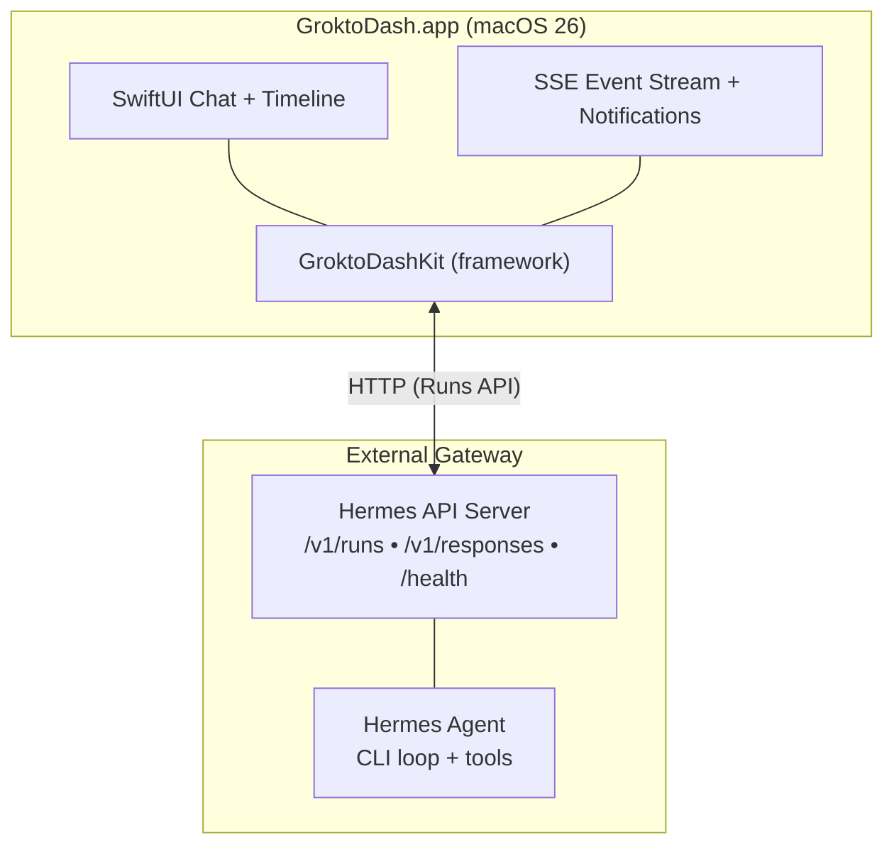

# GroktoDash

==THIS DOESN'T ACTUALLY WORK YET==

GroktoDash is still in very early development.

**Native macOS desktop client for [Hermes Agent](https://github.com/NousResearch/hermes-agent).**

[](LICENSE)
[](https://github.com/groktopus/groktodash/actions/workflows/ci.yml)
[](https://developer.apple.com/macos/)
[](https://swift.org)

GroktoDash is a thin native SwiftUI shell around the Hermes Agent API Server.
It connects to your Hermes gateway over HTTP, using the **Runs API**
(`/v1/runs`) with SSE event streaming for real-time tool progress, approval
workflows, and rich desktop integration.

**No embedded Python. No Electron. No WebKit.** Pure Swift, pure macOS.

## Architecture



## Features

- **Streaming responses** — see Hermes think in real time via SSE
- **Tool execution timeline** — watch tools run, see results as they complete
- **Approval notifications** — native macOS notifications with inline Allow/Deny
- **Menu bar quick-prompt** — ⌘⇧Space to ask Hermes anything
- **Spotlight integration** — find past conversations by content
- **Siri support** — "Ask Hermes to review my PRs"
- **Conversation persistence** — SwiftData with optional iCloud sync
- **Zero-trust security** — App Sandbox, Hardened Runtime, Keychain storage

## Requirements

- macOS 26.0 (Tahoe) or later
- A running [Hermes Agent](https://github.com/NousResearch/hermes-agent) instance with the API Server enabled

## Quick Start

1. **Download** the latest release (or build from source)
2. **Enter your gateway URL** on first launch (e.g. `http://auriga.local:8642`)
3. **Start chatting** — GroktoDash connects to your Hermes gateway

## Building from Source

```bash
git clone https://github.com/groktopus/groktodash.git
cd groktodash
open GroktoDash.xcodeproj
```

Build with ⌘B, run with ⌘R.

Or from the command line:

```bash
xcodebuild -scheme GroktoDash -destination 'platform=macOS' build
```

## Documentation

- [Product Requirements Document](docs/prd.md)
- [Architecture Design Document](docs/architecture.md)
- [Contributing Guide](CONTRIBUTING.md)
- [AI Agent Guide](AGENTS.md)

## License

MIT — see [LICENSE](LICENSE) for details.
