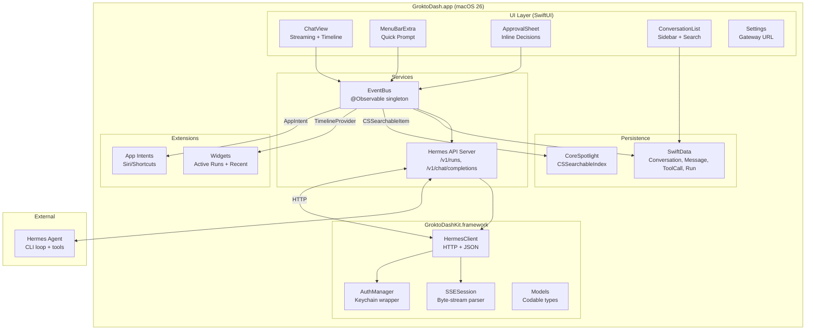
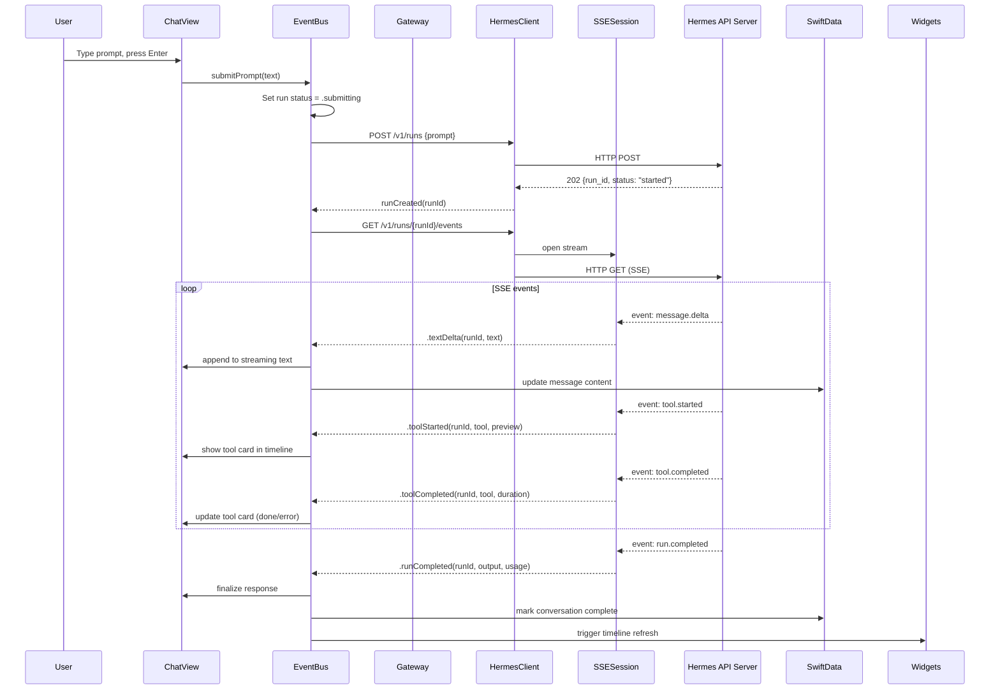
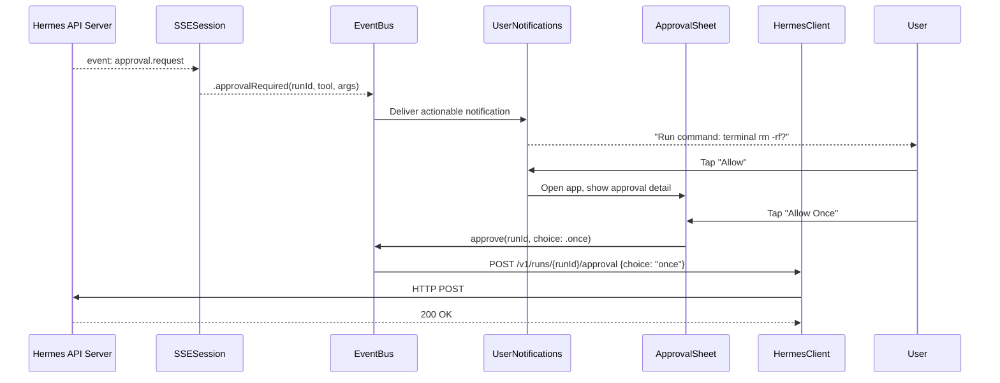
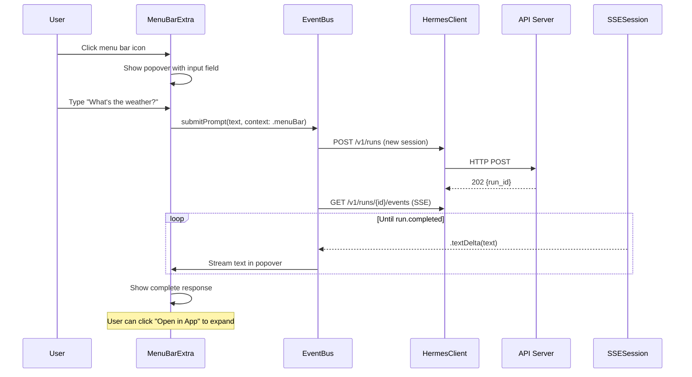
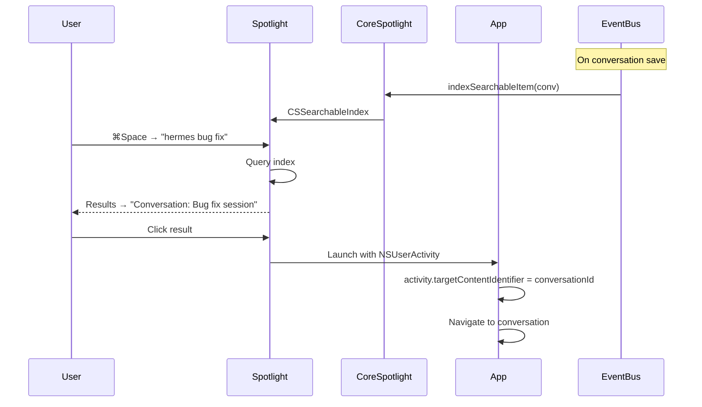

# GroktoDash — Architecture Design Document

**Status:** Draft
**Version:** 0.1.0
**Last updated:** 2026-05-25
**Source validated:** Hermes API Server (`gateway/platforms/api_server.py`)

---

## Table of Contents

1. [Component Model](#component-model)
2. [Target Structure](#target-structure)
3. [Data Flows](#data-flows)
4. [API Contract](#api-contract)
5. [SSE Event Schema](#sse-event-schema)
6. [SwiftData Model](#swiftdata-model)
7. [Dependency Manifest](#dependency-manifest)
8. [Security Model](#security-model)
9. [macOS Tahoe Feature Map](#macos-tahoe-feature-map)
10. [Build Configuration](#build-configuration)

---

## Component Model



### Component Responsibility

| Component | Responsibility |
|-----------|---------------|
| **ChatView** | Primary chat UI: message list + streaming text + tool timeline |
| **MenuPopover** | Menu bar quick-prompt: one-shot runs without opening full app |
| **ApprovalSheet** | Inline tool call approval: approve/deny/session |
| **ConvList** | Sidebar conversation list: search, rename, delete |
| **EventBus** | Central event dispatcher: SSE events → SwiftUI state + persistence + Spotlight |
| **Gateway** | Connection lifecycle: connect/disconnect/reconnect, URL validation |
| **HermesClient** | HTTP client: `POST /v1/runs`, `GET /v1/runs/{id}`, `POST /v1/runs/{id}/approval`, `POST /v1/runs/{id}/stop` |
| **SSESession** | Pure Swift SSE byte-stream parser: splits `event:`/`data:` lines, emits typed events |
| **AuthManager** | Keychain read/write: gateway URL, API key |
| **Models** | Codable types mapping the Hermes API surface |

### Component Boundaries

- **UI Layer** owns no network state. Views observe `@Observable` models published by `EventBus`.
- **Services** bridge UI ↔ HermesClient. No SwiftUI imports.
- **GroktoDashKit** has no UI dependencies. Pure Swift + Foundation.
- **Extensions** (Widgets, Intents) depend on GroktoDashKit for model types but not on the app's UI layer.

---

## Target Structure

```
groktodash/
├── GroktoDash.xcodeproj/
│   └── project.pbxproj              # Multi-target Xcode project
│
├── Sources/
│   ├── GroktoDash/                  # macOS app target
│   │   ├── GroktoDashApp.swift      # @main entry, WindowGroup, MenuBarExtra
│   │   ├── UI/
│   │   │   ├── Chat/
│   │   │   │   ├── ChatView.swift           # Scrollable message list with streaming
│   │   │   │   ├── MessageBubbleView.swift   # User vs Hermes message styling
│   │   │   │   ├── StreamingRenderer.swift   # Live token accumulation from events
│   │   │   │   └── InputBar.swift            # Prompt input + submit
│   │   │   ├── Runs/
│   │   │   │   ├── RunTimelineView.swift      # Tool execution timeline panel
│   │   │   │   ├── ToolCallCard.swift         # Individual tool call display
│   │   │   │   └── ApprovalSheet.swift        # Inline approval UI
│   │   │   ├── Conversations/
│   │   │   │   └── ConversationList.swift     # Sidebar: searchable, sortable
│   │   │   ├── Settings/
│   │   │   │   └── GatewaySettingsView.swift  # URL entry, connection test
│   │   │   └── Components/
│   │   │       ├── MarkdownRenderer.swift     # AttributedString-based rendering
│   │   │       ├── CodeBlockView.swift        # Monospace + background styling
│   │   │       └── MenuBarPopover.swift       # MenuBarExtra quick-prompt
│   │   ├── Services/
│   │   │   ├── EventBus.swift                 # Central event dispatcher
│   │   │   └── GatewayConnection.swift        # URLSession lifecycle
│   │   └── Resources/
│   │       └── Assets.xcassets
│   │
│   ├── GroktoDashKit/               # Framework target (no UI)
│   │   ├── API/
│   │   │   ├── HermesClient.swift            # URLSession async HTTP
│   │   │   ├── SSESession.swift              # Pure Swift SSE parser
│   │   │   ├── AuthManager.swift             # Keychain wrapper
│   │   │   └── Models.swift                  # Run, Event, Message, ToolCall, Approval
│   │   └── Extensions/
│   │       └── SSE+AsyncSequence.swift       # SSE → AsyncSequence bridge
│   │
│   ├── GroktoDashWidgets/           # WidgetKit extension
│   │   ├── GroktoDashWidgets.swift           # TimelineProvider, widget bodies
│   │   └── Views/
│   │       ├── ActiveRunsWidget.swift         # Medium widget: current runs
│   │       └── RecentConversationsWidget.swift # Large widget: recent chats
│   │
│   └── GroktoDashIntents/           # App Intents extension
│       ├── AskHermesIntent.swift              # Siri: "Ask Hermes to..."
│       └── ContinueConversationIntent.swift   # Siri: "Continue my last talk"
│
├── Tests/
│   └── GroktoDashKitTests/
│       ├── HermesClientTests.swift
│       ├── SSESessionTests.swift
│       └── ModelsTests.swift
│
├── docs/
│   ├── prd.md
│   └── architecture.md              # This file
│
├── .github/workflows/ci.yml
├── AGENTS.md
├── CONTRIBUTING.md
├── README.md
└── LICENSE
```

### Target Justifications

| Target | Why |
|--------|-----|
| **GroktoDash (app)** | `@main` entry point, SwiftUI lifecycle, MenuBarExtra scene |
| **GroktoDashKit (framework)** | Isolated API client + models. Testable without the app. No UI imports. |
| **GroktoDashWidgets (extension)** | WidgetKit requires a separate process. Needs read-access to SwiftData store via App Group. |
| **GroktoDashIntents (extension)** | App Intents require a separate process. Passes data to the main app via `USER_ACTIVITY` + `NSUserActivity`. |

---

## Data Flows

### Flow 1: Send Message → Stream Response



### Flow 2: Tool Approval → Notification → Decision



### Flow 3: Menu Bar Quick Prompt



### Flow 4: Spotlight Search → Open Conversation



---

## API Contract

### Hermes API Server Endpoints

GroktoDash uses the following endpoints from the Hermes API Server:

| Method | Endpoint | Purpose | Input | Output |
|--------|----------|---------|-------|--------|
| `GET` | `/health` | Connectivity check | — | `{"status": "ok"}` |
| `GET` | `/v1/capabilities` | Feature discovery | — | Feature flags + endpoint map |
| `POST` | `/v1/runs` | Start a run | `{prompt, instructions?, session_id?, model?}` | `202 {run_id, status: "started"}` |
| `GET` | `/v1/runs/{run_id}` | Poll run status | — | Run status object |
| `GET` | `/v1/runs/{run_id}/events` | SSE event stream | — | SSE event stream (see schema below) |
| `POST` | `/v1/runs/{run_id}/approval` | Resolve approval | `{choice: "once"\|"session"\|"always"\|"deny"}` | `200 OK` |
| `POST` | `/v1/runs/{run_id}/stop` | Interrupt run | — | `200 {"status": "cancelled"}` |
| `POST` | `/v1/chat/completions` | Legacy single-turn (fallback) | OpenAI-format messages | Chat completion response |
| `POST` | `/v1/responses` | Stateful multi-turn (fallback) | OpenAI Responses format | Response object |

### API Authorization

- **Bearer token:** Set via `Authorization: Bearer <token>` header
- **Optional:** When `API_SERVER_KEY` is set on the gateway, the header is required
- **Optional:** When no key is set, auth is open (local network scenarios)

### Session Continuity

- **`X-Hermes-Session-Id` header** — persist conversations across API calls within the same Hermes session
- **`X-Hermes-Session-Key` header** — scope long-term memory to a specific session identity

---

## SSE Event Schema

**Source-validated against `gateway/platforms/api_server.py` (lines 2844-3167)**

All Runs API SSE events follow the format:

```
event: <event_type>
data: <JSON payload>

```

### Event Types

| Event | Direction | Payload Fields | Purpose |
|-------|-----------|---------------|---------|
| `message.delta` | Server → Client | `{event, run_id, timestamp, delta: "text"}` | Streaming text response |
| `reasoning.available` | Server → Client | `{event, run_id, timestamp, text}` | Model reasoning/thinking output |
| `tool.started` | Server → Client | `{event, run_id, timestamp, tool, preview}` | Tool execution began |
| `tool.completed` | Server → Client | `{event, run_id, timestamp, tool, duration, error: bool}` | Tool finished (or errored) |
| `approval.request` | Server → Client | `{event, run_id, timestamp, choices: ["once","session","always","deny"], ...tool_data}` | Approval required |
| `run.completed` | Server → Client | `{event, run_id, timestamp, output, usage}` | Run finished successfully |
| `run.cancelled` | Server → Client | `{event, run_id, timestamp}` | Run cancelled via `/stop` |
| `run.failed` | Server → Client | `{event, run_id, timestamp, error: str}` | Run failed with error |

### Client → Server Events

| Action | Endpoint | Payload |
|--------|----------|---------|
| Approve | `POST /v1/runs/{id}/approval` | `{choice: "once"}` |
| Approve for session | `POST /v1/runs/{id}/approval` | `{choice: "session"}` |
| Approve always | `POST /v1/runs/{id}/approval` | `{choice: "always"}` |
| Deny | `POST /v1/runs/{id}/approval` | `{choice: "deny"}` |
| Stop | `POST /v1/runs/{id}/stop` | — |

### Run Status States

```
queued → running → completed
                 → failed
                 → cancelled
                 → waiting_for_approval (paused until approval resolves)
```

### Legacy Chat Completions SSE (fallback)

When using `/v1/chat/completions` with `stream: true`, the legacy SSE format is used:

```
data: {"id":"...","object":"chat.completion.chunk","choices":[{"index":0,"delta":{"content":"text"},"finish_reason":null}]}

event: hermes.tool.progress
data: {"tool":"search","emoji":"🔍","label":"Searching…","toolCallId":"...","status":"running"}

event: hermes.tool.progress
data: {"tool":"search","toolCallId":"...","status":"completed"}

data: [DONE]
```

GroktoDash's `SSESession` handles both formats, routing legacy tool progress events through the same `EventBus` pipeline.

---

## SwiftData Model

```swift
@Model
final class Conversation {
    var id: UUID
    var title: String
    var createdAt: Date
    var updatedAt: Date
    @Relationship(deleteRule: .cascade) var messages: [Message]
    @Relationship(deleteRule: .cascade) var runs: [Run]
}

@Model
final class Message {
    var id: UUID
    var role: Role          // user | hermes
    var content: String
    var timestamp: Date
    var conversation: Conversation?
    @Relationship(deleteRule: .cascade) var toolCalls: [ToolCall]
}

enum Role: String, Codable {
    case user
    case hermes
}

@Model
final class ToolCall {
    var id: String          // toolCallId from API
    var toolName: String
    var preview: String
    var status: ToolStatus  // running | completed | error
    var duration: Double?
    var message: Message?
}

enum ToolStatus: String, Codable {
    case running
    case completed
    case error
}

@Model
final class Run {
    var runId: String
    var status: RunStatus
    var output: String?
    var usageInputTokens: Int?
    var usageOutputTokens: Int?
    var createdAt: Date
    var conversation: Conversation?
}

enum RunStatus: String, Codable {
    case queued
    case running
    case completed
    case failed
    case cancelled
    case waitingForApproval
}
```

### Indexing Strategy

- `Conversation.updatedAt` — indexed for sidebar sorting
- `Message.content` — full-text search via CoreSpotlight (not SwiftData predicates)
- `Run.runId` — unique lookup for polled status

### App Group Compatibility

SwiftData store is placed in an App Group container for Widget extension read access:

```
~/Library/Group Containers/<app-group>/Library/Application Support/default.store
```

---

## Dependency Manifest

| Dependency | Version | License | Justification | Risk |
|-----------|---------|---------|---------------|------|
| **None** | — | — | Current architecture needs zero third-party dependencies | — |

### Potential Future Additions

| Dependency | Version | License | When Needed | Risk |
|-----------|---------|---------|------------|------|
| `swift-async-algorithms` | latest stable | Apache 2.0 | If SSE splitting requires `AsyncSequence` combinators beyond manual parsing | Low (Apple OSS) |
| `Down` | latest stable | MIT | If `AttributedString(markdown:)` proves insufficient for rich rendering | Low (pure Swift, widely audited) |

### Prohibited

| Category | Examples | Reason |
|----------|----------|--------|
| GPL-family | Any GPL, AGPL, SSPL | License incompatibility with MIT |
| CocoaPods | — | Supply chain surface; SPM is sufficient |
| Carthage | — | Binary distribution; impairs auditability |
| Analytics SDKs | Firebase, Amplitude, Sentry | No telemetry policy |
| Web views | WKWebView, WebKit | JavaScript execution surface |
| Binary `.xcframework` | — | Cannot audit source |

---

## Security Model

### Credential Storage

```
┌─────────────────────────────────────────┐
│  macOS Keychain                          │
│                                          │
│  Service: com.groktopus.groktodash       │
│  Accounts:                               │
│    - gatewayUrl  → http://auriga:8642    │
│    - apiKey      → sk-...                │
└─────────────────────────────────────────┘

Access: GroktoDash + GroktoDashKit (same keychain group)
```
- Gateway URL and API key stored exclusively in macOS Keychain
- Never written to UserDefaults, AppStorage, or plain files
- Keychain access: `kSecClassInternetPassword` for URL, `kSecClassGenericPassword` for API key

### Sandbox Entitlements

```xml
<key>com.apple.security.app-sandbox</key>
<true/>
<key>com.apple.security.network.client</key>
<true/>
```

| Entitlement | Required? | Justification |
|-------------|-----------|---------------|
| `app-sandbox` | Yes | Required for notarization. Limits file access to app container. |
| `network.client` | Yes | Required to connect to Hermes API Server. Outbound HTTP only. |
| `network.server` | No | GroktoDash does not listen on any port. |
| `files.downloads.read-write` | No | No file export in M1-M3. Future: for conversation export. |
| `bluetooth` | No | No Bluetooth features. |

### Hardened Runtime

```xml
<key>com.apple.security.cs.disable-library-validation</key>
<false/>
<key>com.apple.security.cs.allow-jit</key>
<false/>
<key>com.apple.security.cs.allow-unsigned-executable-memory</key>
<false/>
<key>com.apple.security.cs.allow-dyld-environment-variables</key>
<false/>
<key>com.apple.security.cs.disable-executable-page-protection</key>
<false/>
```

All flags at their most restrictive defaults.

### Network Allowlist

GroktoDash only connects to the **single configured gateway URL**. No other outbound connections:

- `URLSession` configuration: single-host restriction via `waitsForConnectivity` + Host header validation
- No embedded web views — no JavaScript execution surface
- No analytics, no telemetry, no crash reporting service

### Data at Rest

- **SwiftData store:** SQLite in App Group container. Encrypted by FileVault (if enabled).
- **Keychain:** Encrypted by Secure Enclave.
- **Logs:** Unified logging (`os.Logger`). Never logs message content or API keys. Log level: `debug` (development), `info` (release).

---

## macOS Tahoe Feature Map

| Technology | Framework | User Story | Implementation |
|-----------|-----------|------------|----------------|
| **SwiftUI** | SwiftUI | US-01, US-02 | All UI: ChatView, Timeline, InputBar |
| **`@Observable`** | Observation | Framework | EventBus, GatewayConnection |
| **SwiftData** | SwiftData | US-03 | Conversation, Message, ToolCall, Run |
| **`URLSession` async/await** | Foundation | US-01, US-04 | HermesClient networking |
| **`Security.framework`** | Security | US-04, FR-08 | Keychain read/write |
| **`MenuBarExtra`** | SwiftUI | US-05 | Scene type in GroktoDashApp |
| **`UserNotifications`** | UserNotifications | US-06 | UNNotificationAction (Approve/Deny) |
| **`CoreSpotlight`** | CoreSpotlight | US-07 | CSSearchableItem + CSSearchableIndex |
| **`AppIntents`** | AppIntents | US-08 | AskHermesIntent, ContinueIntent |
| **`WidgetKit`** | WidgetKit | US-09 | TimelineProvider, medium+large widgets |
| **`CloudKit`** | CloudKit | US-12 | SwiftData iCloud sync (P3) |

### VoiceOver / Accessibility

All views use native SwiftUI controls — accessible by default. Additional:
- `accessibilityLabel` on all custom views
- `accessibilityHint` on interactive elements
- Dynamic Type support throughout
- Keyboard navigation: full control via Tab, Enter, Escape

---

## Build Configuration

| Setting | Value |
|---------|-------|
| **Project format** | `.xcodeproj` (required for extension targets) |
| **Minimum deployment** | macOS 26.0 |
| **Swift language version** | 6.3 |
| **Swift tools version** | 6.3 |
| **Architecture** | arm64 (Apple Silicon) |
| **Signing** | Manual signing for development; Apple Developer ID for distribution |
| **Sandbox** | Enabled |
| **Hardened Runtime** | Enabled |
| **Build system** | New Build System (default) |

### Build Commands

```bash
# Build all targets
xcodebuild -scheme GroktoDash -destination 'platform=macOS' build

# Run tests
xcodebuild -scheme GroktoDash -destination 'platform=macOS' test

# Archive for distribution
xcodebuild -scheme GroktoDash -destination 'platform=macOS' archive
```
